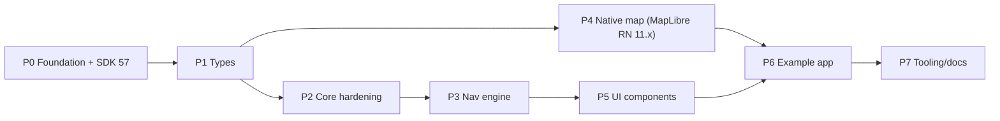

# osm-navigator — Fix Plan

**Scope:** every audit finding (P0–P3), on **Expo SDK 57** (React Native 0.86, React 19.2), with the upgrade done in Phase 0 ([ADR 0002](./docs/adr/0002-expo-sdk-57-baseline.md)). `apps/example` gets deleted. Reference: [project_audit.md](./project_audit.md)

Each phase ends with a **checkpoint**: I verify the work, report back, and wait for your go-ahead before the next phase.

## Progress

Status: ✅ done · 🟡 in progress · ⬜ not started. Update this table and the phase's checklist whenever work lands.

| Phase | Status | Commit(s) | Notes |
|---|---|---|---|
| 0 — Foundation + SDK 57 | ✅ | `6c1ca67`, `aeeef3c` | Checkpoint passed on 2026-10-04. |
| 1 — Types and package hygiene | ✅ | `aeeef3c` (squashed with the Phase 0 follow-up) | Checkpoint passed on 2026-10-04. |
| 2 — Core service hardening | ✅ | `e876921` | Checkpoint passed on 2026-10-04. |
| 3 — Navigation engine | ✅ | `5091ccc` | Checkpoint passed on 2026-10-04. |
| 4 — Native map layer | ✅ | `4005e79` | Checked on a physical device (Redmi Note 10 Pro, Android 13) on 2026-10-04. |
| 5 — UI components | ✅ | `501433d` | Checkpoint passed on 2026-10-04; visual review on device. |
| 6 — Example app rebuild | ✅ | see Phase 6 checkpoint | Checked on a physical device (Redmi Note 10 Pro, Android 13) on 2026-10-04. |
| 7 — Tooling and docs | ⬜ | | Next up. |

---

## Decisions

### D1. How to build the native map layer — ✅ DECIDED: Option C (A now, B later)
Recorded in [ADR 0001](./docs/adr/0001-native-map-rendering-strategy.md). Uses `@maplibre/maplibre-react-native` **11.x**.

### D5. Expo SDK — ✅ DECIDED: SDK 57, upgraded in Phase 0
Recorded in [ADR 0002](./docs/adr/0002-expo-sdk-57-baseline.md).

Original D1 analysis

You said no native code exists. Writing a MapLibre wrapper from scratch in Swift and Kotlin is the **single largest and riskiest piece** of this project. It's realistically weeks of work across two platforms, plus ongoing maintenance whenever MapLibre releases. I want to challenge whether it's worth doing first.

| Option | Pros | Cons |
|---|---|---|
| **A. (Recommended) Wrap `@maplibre/maplibre-react-native` behind our own `MapView` API** | Unblocks the app in days. Mature and battle-tested. Our public API (`MapViewProps`, `MapViewRef`) stays ours, so we can swap the internals later without breaking users. | Adds a large dependency. We inherit its New Architecture status and release cadence (version compatibility with SDK 51 still needs checking). |
| **B. Write our own Expo Module (Swift + Kotlin)** | Full control and a smaller surface. Matches the README's stated vision. | Weeks of work before anything renders. Two native codebases to maintain. Hard to test. Blocks every end-to-end check. |
| **C. A now, B later** | Same as A now. B becomes a roadmap item once the JS side is proven. | Same as A for the time being. |

**Why I recommend A/C:** the value of this SDK is routing, the navigation engine and the UI. The map renderer is the commodity part. Hand-writing it first delays everything else. The interface layer in Phase 4 keeps B open for later.

### D2. Runtime validation of API responses
- **(Recommended) Hand-written type guards.** No dependencies, and the response shapes are small.
- Zod: less code to write, but adds roughly 50 KB plus a dependency to a core SDK package.

### D3. Maneuver icons
- **(Recommended) `react-native-svg` as a peer dependency** with vector arrow paths. Themeable (honours `color`) and identical on every platform.
- Bundled PNG sets: no extra dependency, but they can't be recoloured and each icon needs several resolutions.

### D4. Test runner
- **(Recommended) Jest + `jest-expo`.** The standard choice for RN/Expo, and it covers both the pure TypeScript in `core` and component tests.

---

## Phase 0 — Repo foundation + SDK 57 baseline (makes the project buildable)

Fixes audit P0 #2, #3, #4 and most of P3, and moves to SDK 57.

| Change | Files |
|---|---|
| **Upgrade to Expo SDK 57:** `expo@~57`, then `npx expo install --fix` to align `react-native` 0.86.3, `react` 19.2.3, `expo-router`, `expo-location`, `expo-speech`, `expo-dev-client`, `react-native-screens` and `safe-area-context`. Remove the pin on `expo-modules-autolinking`. Bump `@types/react` to 19. | `apps/navigation-example/package.json`, root `package.json` |
| Review the SDK 52–57 release notes for breaking changes in router, location and speech; record them in the checkpoint report | — |
| Anchor native ignores to app folders only (`/apps/*/ios/`, `/apps/*/android/`) and add `*.tsbuildinfo` | [.gitignore](./.gitignore) |
| Untrack the committed `tsconfig.tsbuildinfo` files | `packages/*/tsconfig.tsbuildinfo` |
| Delete the duplicate demo app | `apps/example/` |
| Remove the meaningless root Expo config | root `app.json`, the `expo` block and the `native-map` devDep in root [package.json](./package.json) |
| Rename the Metro config so Metro actually loads it | `apps/navigation-example/metro-config.js` → `metro.config.js` |
| Consistent entrypoints: `main`/`types` → `dist/` (for publishing) and `"react-native": "src/index.ts"` (Metro reads this field first, so no build step is needed during development) | `packages/*/package.json` |
| Drop the hand-written monorepo overrides (`extraNodeModules`, `watchFolders`, `disableHierarchicalLookup`). SDK 52+ configures monorepos automatically; keep only what verification proves is necessary. | `metro.config.js` |
| Delete the redundant root-level `index.ts` re-export files in each package | `packages/*/index.ts` |
| Update stale docs | [.workspace](./.workspace), README structure table |

**Verify:**
- `yarn install` succeeds.
- `npx expo-doctor` reports no version mismatches.
- `yarn typecheck` runs; I record the baseline errors, which are expected and fixed in Phase 1.
- Metro resolves all `@osm-navigator/*` imports (`npx expo export --platform android` gets past resolution).

### Phase 0 checkpoint (2026-10-04)

Results:
- ✅ `yarn install` works. Yarn 1.22.22 comes from Corepack and is pinned via `packageManager`.
- ✅ `npx expo-doctor`: all 21 checks pass.
- ✅ `npx expo export --platform android --clear` bundles 1221 modules, and every `@osm-navigator/*` import resolves. One earlier run failed on `expo/AppEntry`; it looked like a stale cache and didn't happen again.
- ✅ Typecheck baseline (`tsc --noEmit` per workspace):

  | Workspace | Errors |
  |---|---|
  | `core` | 0 |
  | `native-map` | 0 |
  | `ui-navigation` | 3: `@osm-navigator/core` not found; implicit `any` in `TurnByTurnOverlay` |
  | `navigation-example` | 6: `@osm-navigator/*` not found; implicit `any` `coords`; `StyleSheet.absoluteFillObject` removed in RN 0.86 → `absoluteFill` |

  All of these are Phase 1 work.
- ✅ SDK 52–57 breaking changes, checked against the APIs the app actually uses:
  - `expo-router`: `Stack`
  - `expo-location`: permissions, `watchPositionAsync`, `getCurrentPositionAsync`, `Accuracy`
  - `expo-speech`: `speak`, `stop`

  The SDK 57 type definitions only flag `absoluteFillObject`.

Leftovers to close Phase 0:
- [x] Make the links in this plan relative.
- [x] Update `.workspace`: it still points to `/apps/example`.
- [x] Minimal README correction. Requirements still say SDK 51 / RN 0.74, and the roadmap claims a MapLibre Expo Module exists. The full rewrite is Phase 7.
- [x] Remove `expo.autolinking.searchPaths` from `apps/navigation-example/package.json`, plus the dangling `packages/native-map/expo-module.config.json` and the `expo` block in its `package.json`. They make autolinking look for native classes that don't exist, which will break the first `expo prebuild`. This was scheduled for Phase 4; it's moved here because it's cheap.
- [x] Decide what to do with `implementation_plan.md.metadata.json`, `project_audit.md.metadata.json` and `transcript_full.jsonl`: gitignored. The plan and audit are committed.

Noted for Phase 1: `expo install --fix` moved the app to TypeScript `~6.0.3`, but the root is still `^5.4` (5.9.3 installed). Settle on one version at the root, TS 6, because that's what SDK 57 expects.

---

## Phase 1 — Types and package hygiene

Fixes audit P2 type safety.

- **Single source of truth for shared types in `core`:** `LngLat`, `CameraState` and `ManeuverType` (moved from ui-navigation). `RouteStep.maneuverType: ManeuverType`, not `string`. native-map and ui-navigation re-export or import them.
- **Remove all `any`:**
  - `MapView` events get a typed `NativeSyntheticEvent<…>`.
  - `catch (e: unknown)` combined with a shared `toErrorMessage(e: unknown): string` helper in core.
- **Correct dependency declarations:**
  - `ui-navigation` → dependency on `@osm-navigator/core`.
  - All UI and native packages → peer deps on `react` / `react-native` with real ranges.
- **TS project references:** ui-navigation → core, native-map → core.
- **One TypeScript version:** a single root `typescript`; remove it from the app.
- **Fix the compile errors found while reading:**
  - Switch to `jsx: react-jsx` (automatic runtime).
  - Use React 19 patterns: `ref` as a prop instead of `forwardRef`, and `React.JSX` types.
  - Type the `DimensionValue` for the progress width.
  - Remove `fontWeight` from the View style.
- **Add an ESLint config** (`@typescript-eslint/no-explicit-any: error`, `react-hooks` plugin).

**Verify:** `yarn typecheck` and `yarn lint` both pass with zero errors.

### Phase 1 checkpoint (2026-10-04)

Results:
- ✅ `yarn typecheck` (`tsc -b` + app): **0 errors**, down from 9.
- ✅ `yarn lint` (ESLint 10 flat config, `eslint.config.mjs`): **0 problems** across 27 files. `no-explicit-any` is confirmed to fire.
- ✅ No `any` left in `packages/*/src` or the app.
- ✅ Regression checks: `expo-doctor` passes all 21 checks, and the Android export bundles (1223 modules).

What changed beyond the plan bullets above:
- **TypeScript 6.0.3** is now the single version, at the root. ESLint 10 + `typescript-eslint` 8.71 (supports TS `<6.1`) + `eslint-plugin-react-hooks` 7 replace ESLint 8 / `@typescript-eslint` 7, which don't support TS 6.
- **`typecheck` and `build` are `tsc -b`.** The root `tsconfig.json` is solution-style. `tsc -b` writes `dist/` declarations (gitignored), and the app resolves package types through them.
- **Dependency declarations:**
  - `native-map` and `ui-navigation` depend on `@osm-navigator/core ^0.1.0`;
  - peer deps `react ^19.1.0` and `react-native >=0.80.0` (`native-map` also `expo >=54.0.0`);
  - devDeps pinned to the app's versions.
- **`MapView` uses the React 19 `ref` prop**, with no `forwardRef`. The ref is accepted but wiring it via `useImperativeHandle` is Phase 4.

Deferred: none. React Compiler rules (react-hooks 7) raised nothing in the app.

---

## Phase 2 — Core service hardening

Fixes audit P1 core services.

- **New `core/src/http/` (DRY):** a `requestJson<T>(url, init, guard, { timeoutMs, signal })` helper that adds:
  - timeouts via `AbortController` and support for a caller-supplied `signal`;
  - typed errors: `NetworkError`, `TimeoutError`, `ServiceError(status, body)`, `InvalidResponseError`;
  - a configurable `User-Agent` / headers taken from config (fair-use compliance).
- **Response guards** (D2) for Valhalla and Photon responses. No more blind `as` casts.
- **Valhalla:**
  - Request `units: "kilometers"`.
  - Handle **all legs** and concatenate geometry and steps with corrected shape offsets.
  - Complete the maneuver mapping (exits → slight-left/right; add roundabout, merge, ferry and keep variants).
  - Drop the `[0, 0]` fallback and throw `InvalidResponseError` instead.
  - Accept `signal`.
- **Photon:** accept `signal` and validate responses.
- **Config:**
  - `initOSMNavigator` validates the URLs and strips trailing slashes.
  - Add `requestTimeoutMs` and `userAgent`.
  - `getConfig()` returns a `Readonly` copy.
- **Tests (D4):**
  - polyline6 decoder against known vectors;
  - maneuver mapping table;
  - both clients with mocked `fetch` covering success, HTTP error, timeout, malformed body and multi-leg.

**Verify:** `yarn test` passes, and coverage of `core/src` is at least 90%.

### Phase 2 checkpoint (2026-10-04)

Results:
- ✅ `yarn test`: **139 tests in 7 suites**, with **100%** statement, branch, function and line coverage of `packages/core/src`. The 90% threshold is enforced in `jest.config.js`.
- ✅ `yarn typecheck` (now also type-checks the tests via `packages/core/tsconfig.test.json`) and `yarn lint`: 0 errors.
- ✅ Live check against the public Valhalla and Photon endpoints: `fetchRoute` with a waypoint, `geocode` and `reverseGeocode` all pass, and step indices are consistent with the geometry.
- ✅ Regression checks: `expo-doctor` passes all 21 checks, and the Android export bundles (1230 modules).

Found during the phase (not in the audit):
- **Route totals were broken.** Valhalla returns the totals in `trip.summary`, not on `trip`, so `distanceMeters` was `NaN` and `durationSeconds` was `undefined`. The raw types and the code now follow the real response; I checked one against a live request.
- **Yarn v1 hoisting defect.** After Jest was added, a stale `@babel/traverse` 7.29.0 led to a nested Babel helper set that resolved `lru-cache` v10 instead of v5, which broke Babel under Jest. Fixed with `yarn-deduplicate --scopes @babel` (minor and patch bumps within Babel 7 only).

Decisions:
- **D4 adjusted:** `core` tests run on plain `babel-jest` in Node, not with the `jest-expo` preset. That preset installs Expo's native runtime globals, including its own `fetch`, which would get in the way of the mocks. `jest-expo` stays the choice for component tests in Phase 5. `babel-preset-expo` is pinned as a root devDep.
- **`RouteStep.geometryIndex`** was added now, because Phase 3's engine needs precomputed step start indices.
- **Error types live in `core/src/errors.ts`** and are exported publicly: `OSMNavigatorError` and its subclasses `ConfigError`, `NetworkError`, `TimeoutError`, `AbortError`, `ServiceError` and `InvalidResponseError`. `AbortError` and `ConfigError` were added beyond the plan, so cancellation and bad config can be told apart from failures.
- **`ManeuverType` is extended** with `depart`, `sharp-*`, `keep-*`, `merge`, `roundabout` and `ferry`. `ManeuverIcon` uses an exhaustive placeholder glyph map until Phase 5.

Known follow-ups:
- `packages/core/README.md` documents an API that never existed (`osm.valhalla.route`). It gets rewritten in Phase 7.
- Intermediate `break` waypoints produce a mid-route `arrive` step. Phase 3's engine should latch arrival only at the end of the route.

---

## Phase 3 — Navigation engine (moved out of the app screen)

Fixes audit P1 #6, #7, #8.

- **`core/src/geo/`:** `haversineDistance`, `bearing`, `projectOntoSegment` and `cumulativeDistances`, all pure and tested.
- **`core/src/navigation/NavigationEngine`:** a pure, framework-agnostic state machine.
  - `new NavigationEngine(route, options)` → `update(position): NavigationState`.
  - Snaps to the nearest **segment** within a **forward-looking window**, so progress only moves forward and looping routes don't cause jumps.
  - Uses precomputed step start *indices*, not `indexOf` on coordinates.
  - **Along-route** distance to the next maneuver and to the destination, plus a progress fraction.
  - **Latched arrival**, emitted exactly once.
  - **Off-route detection** (distance threshold plus hysteresis) emitted as state. Rerouting stays the app's decision.
  - Events: `onStepChange`, `onArrive`, `onOffRoute`, which drive voice prompts with no duplicates.
- `NavigationState` moves to core and is extended with `distanceRemainingMeters`, `progress` and `isOffRoute`.
- **Tests:** synthetic routes (straight, L-turn, loop-back, overlapping), GPS jitter, arrival latch, off-route.

**Verify:** engine tests pass. Each loop-back and overlap scenario test asserts that progress never moves backward.

### Phase 3 checkpoint (2026-10-04)

Results:
- ✅ `yarn test`: **179 tests in 9 suites**, with 100% statement, branch, function and line coverage of `packages/core/src`.
- ✅ The scenarios each assert their own guarantee:
  - **straight route:** snapping and along-route distances;
  - **L-turn:** distance to the turn measured along the road, and `onStepChange` fires once;
  - **out-and-back:** progress never decreases, and the same point reads 400 m on the way out and 600 m on the way back;
  - **self-crossing route** (with a 5 km look-ahead): the earlier pass wins;
  - **look-ahead window:** fixes beyond it don't snap;
  - **GPS jitter:** lateral plus backward noise keeps progress monotonic, with no off-route and no step flapping;
  - **off-route:** the 3-fix confirmation, hysteresis between 15 m and 30 m, a single spike ignored, and no arrival while off-route;
  - **arrival:** latched, `onArrive` fires once, and later fixes return the same state object;
  - **off-road destination;** a route that passes near its destination early doesn't end early;
  - **the real two-leg Valhalla fixture:** walked end to end, step changes stay in order, and the first leg's `arrive` doesn't latch arrival;
  - **degenerate routes:** no steps, a single point, no geometry, and invalid options.
- ✅ `yarn typecheck` and `yarn lint`: 0 errors. The Android export bundles (1233 modules).

What was built:
- **`core/src/geo/`:** `haversineDistance`, `bearing`, `projectOntoSegment` (a local equirectangular projection) and `cumulativeDistances`.
- **`core/src/navigation/`:** the `NavigationEngine` class and the `NavigationState` / `NavigationEngineOptions` types. `ui-navigation` now re-exports `NavigationState` from core.
- **`NavigationState` gained** `distanceRemainingMeters`, `progress`, `isOffRoute`, `snappedPosition`, `distanceFromRouteMeters` and `routeBearing`.
- **Defaults:**

  | Option | Default |
  |---|---|
  | off-route threshold | 30 m |
  | on-route threshold | 15 m |
  | off-route confirmations | 3 fixes |
  | arrival threshold | 20 m |
  | look-ahead | 500 m |
  | tie tolerance between candidate segments (earlier wins) | 3 m |

Decisions:
- **One callback for off-route: `onOffRouteChange(isOffRoute, state)`.** It replaces the planned `onOffRoute` and covers both leaving and rejoining the route. Rerouting stays the app's decision.
- **Arrival needs the fix itself to be near the route,** or near the destination once it's within the look-ahead. Tests caught a short-route false arrival without this.
- **The app screen isn't wired to the engine yet.** That happens in Phase 6 (`useNavigationSession`), so the old geo helpers stay in `app/index.tsx` until then.

---

## Phase 4 — Native map layer (approach set by D1)

Fixes audit P0 #1 and the MapView P1 findings.

Same for every D1 option:
- `MapView` reads its default `styleURL` from `getConfig().mapStyleURL`.
- **`ref` wired** via `useImperativeHandle`: `animateTo`, `fitBounds`, `takeSnapshot`.
- **Events bridged:** `onMapLoaded`, `onCameraChange`, `onPress`, `onLongPress`, plus a new `onMapError` (style or tile load failure).
- `route` is rendered as a GeoJSON line layer, and `showUserLocation` is honoured.

Option-specific:
- **A/C:** an adapter in `native-map/src/` maps our props to `@maplibre/maplibre-react-native`. Delete the dangling `expo-module.config.json` until option B happens.
- **B:** `packages/native-map/ios/*.swift` and `android/src/**/*.kt` as an Expo Module with view props, events and `AsyncFunction` view commands. Probably split into sub-phases 4a (iOS) and 4b (Android).

The config plugin either gets rewritten to set location permission strings (iOS `NSLocationWhenInUseUsageDescription`, Android permissions), or deleted in favour of the `expo-location` plugin. **I recommend deleting it** to avoid duplicating what expo-location already does.

**Verify:** a dev build runs on an Android emulator. The map renders, a press sets a destination, the route draws, and `animateTo` works.

### Phase 4 checkpoint (2026-10-04)

The device check ran on a **physical device** (Redmi Note 10 Pro, arm64, Android 13) instead of the emulator:
- ✅ The map renders: the OpenFreeMap Liberty style, the MapLibre logo and the attribution control.
- ✅ A press sets a destination.
- ✅ `animateTo`: choosing a search result moves the camera to it.
- ✅ The route draws as a line layer, and the controlled camera follows the user, tilted.
- ✅ The native user-location puck shows.
- ✅ Bonus: a route over Valhalla's 1500 km limit fails with a readable `ServiceError` alert.
- ✅ `yarn typecheck`, `yarn lint` and `yarn test` (179 tests) all pass.

What was built:
- **`native-map` is an adapter over `@maplibre/maplibre-react-native` 11.4.1** (ADR 0001):
  - `Map`, `Camera`, `GeoJSONSource` + a line `Layer`, and `NativeUserLocation`;
  - `ref` via `useImperativeHandle`: `animateTo` → `easeTo`, `fitBounds`, and `takeSnapshot` → `createStaticMapImage`;
  - events: `onPress`, `onLongPress`, `onCameraChange`, `onMapLoaded`, and the new `onMapError`;
  - the default style comes from `getConfig().mapStyleURL`.
- **New props:** `cameraAnimationDurationMs`, `routeColor`, `routeWidth` and `userLocationMode` (`default` | `heading` | `course`).
- **Removed:** the no-op `app.plugin.js`, `README.plugin.md` and the `expo-modules-core` native-view stub.
- **Plugins:** `@maplibre/maplibre-react-native` and `expo-location` (with a `locationWhenInUsePermission` string) are now in the app's plugins.
- **Dependencies:** MapLibre is a direct dependency of the app (needed for native autolinking) and a peer dependency of `native-map`.

Found on the device:
- **The puck arrow looked wrong when turning.** The adapter hard-coded `mode="course"` (GPS direction of travel), which freezes when stationary and is noisy on foot. The puck mode is now a prop, and the example app uses `"heading"` (compass).
- **The camera rotation is noisy.** The old screen code computes the bearing between consecutive raw GPS fixes. **Phase 6** should drive the camera from `NavigationEngine`'s snapped `routeBearing`.
- **Direction accuracy is still not good enough (user feedback after the `heading` fix).** Phase 6 must:
  - drive the camera bearing from `NavigationEngine.routeBearing` instead of raw GPS fixes;
  - show the puck at the engine's `snappedPosition` while on route;
  - pick `course` above walking speed (the GPS course is reliable there) and `heading` below it;
  - smooth the bearing (ignore changes under a few degrees, ease rotations).

  The compass on the device may also need calibrating (figure-8 motion).
- **The banner shows the wrong step.** The screen passes the *current* step ("Drive south", depart icon) together with the distance to the *next* maneuver. It should show the upcoming maneuver ("93 m · Turn right", right-turn icon), with the step after it as "Then". Fix in Phase 6 when wiring `NavigationState`.
- **Expo Go can't run this app.** It has no MapLibre native code (`MLRNCameraModule could not be found`), so the dev build has to be used.

Build notes:
- Use Android Studio's JDK 21 (`JAVA_HOME=/opt/android-studio/jbr`). The system JDK is 25.
- The first native build downloads several hundred MB from Google's Maven and Maven Central. On a slow link, Gradle looks hung during this; `--info` shows the downloads.
- Wireless ADB can drop mid-install. MIUI also blocks `adb shell input` unless "USB debugging (Security settings)" is enabled.
- `expo prebuild` warns that `userInterfaceStyle` needs `expo-system-ui`. Phase 6 should add it.

---

## Phase 5 — UI components and design system

Fixes audit P2 UI.

- **`ui-navigation/src/theme/`:** design tokens (colours, spacing, radii, typography) plus a `NavigationThemeProvider` / `useNavigationTheme`. Components stop hard-coding colours.
- **`ui-navigation/src/format/`:** `formatDistance(m, units, locale)` and `formatDuration(s)`, shared and tested.
- **ManeuverIcon:** SVG paths (D3) that honour `color`, covering the full `ManeuverType` set.
- **NavigationBanner:** uses the theme and formatters, and guards against long text.
- **TurnByTurnOverlay:**
  - honour `units` and `onClose`;
  - scrollable list with stable keys;
  - readable contrast;
  - empty state when the route has no steps.
- **RouteProgressBar:** themed and accessible (`accessibilityRole="progressbar"`, `accessibilityValue`).
- **New components:**
  - `OffRouteBanner` (rerouting / off-route state);
  - `ArrivalCard` (extracted from the app);
  - `ErrorBanner` (offline / service errors), reusable.
- Component tests with `@testing-library/react-native`.

**Verify:** component tests pass, and I review the screens visually in the emulator.

### Phase 5 checkpoint (2026-10-04)

Results:
- ✅ `yarn test`: **256 tests in 16 suites** (77 new for `ui-navigation`), with **100%** coverage of `core` and `ui-navigation`.
- ✅ `yarn typecheck` (now also type-checks the `ui-navigation` tests) and `yarn lint`: 0 errors.
- ✅ Visual review on the physical device, through the new dev-only **component gallery** (`app/gallery.tsx`, linked from the main screen in dev builds). It shows every component and all 15 icons, with dark/light and metric/imperial toggles. The user reviewed it and reported no issues.

What was built:
- **`theme/`:**
  - `darkNavigationTheme` (default) and `lightNavigationTheme`, covering colours, spacing, radii and typography;
  - `NavigationThemeProvider` with per-group partial `overrides`;
  - `useNavigationTheme()` and `mergeNavigationTheme()`.
- **`format/`:**
  - `formatDistance(m, units, locale)` with navigation-style rounding: 5 m / 10 m steps, km or mi with one decimal under 10, feet below 0.1 mi;
  - `formatDuration(s)`;
  - the `Units` type.
- **`ManeuverIcon`:** SVG strokes (D3) for all 15 `ManeuverType`s, with faded branches on forks. It honours `color`, has accessible labels (`maneuverLabel()`), and unknown types fall back to `straight`.
- **Reworked components:**
  - `NavigationBanner`: themed, `units`/`locale`, 2-line clamp and a single spoken summary;
  - `TurnByTurnOverlay`: `units`, `onClose`, a `FlatList` with stable keys, a highlighted current step, past steps dimmed, and an empty state;
  - `RouteProgressBar`: themed, `progressbar` role with `accessibilityValue`, clamped.
- **New components:** `OffRouteBanner`, `ArrivalCard` and `ErrorBanner` (`error` / `offline` variants).
- **Dependencies:** `react-native-svg` 15.15.4 is a peer dependency of `ui-navigation` and a direct dependency of the app (it's native, so this needed a rebuild).

Decisions:
- **D4 in practice:** `ui-navigation` tests run on the `jest-expo` preset with `@testing-library/react-native` 14 (async `render` / `fireEvent`, on `test-renderer`), while `core` stays on plain Node. A package-local `babel.config.js` serves Jest only.
- **Banner containers keep `accessibilityRole="alert"` but aren't grouped as one accessible element,** so the Retry, Reroute and Done buttons stay individually focusable.
- **`TurnByTurnOverlay` doesn't auto-scroll to the current step:** `initialScrollIndex` is unreliable without fixed row heights. It can come back if needed.

---

## Phase 6 — Rebuild the navigation example app

Fixes audit P1 #5, #9, #10, #11.

- Split the 525-line screen into:
  - `SearchPanel`;
  - `NavigationHUD`;
  - `useDestinationSearch` (debounce + `AbortController`, latest request wins);
  - `useLocationTracking` (subscription that's safe against the cleanup race);
  - `useNavigationSession` (wraps `NavigationEngine` and speech).
- **Location:**
  - `getCurrentPositionAsync` gets a timeout and falls back to `getLastKnownPositionAsync`;
  - permission-denied state with an "Open Settings" action.
- **Loading:** the Start button is disabled and shows a spinner while a route loads. No overlapping requests.
- **States:**
  - empty search results;
  - search and route errors with a retry action;
  - offline banner;
  - off-route → automatic reroute with a debounce.
- Arrival stops tracking and speaks once.

**Verify:** a manual test pass in the emulator using a mocked GPS route (`adb emu geo fix` / a GPX file): start, follow, a forced off-route, arrival, and exit mid-start (the leak check).

### Phase 6 checkpoint (2026-10-04)

Results:
- ✅ `yarn test`: **351 tests in 24 suites**, with about 99% statement, 96% branch and 100% line coverage across `core`, `ui-navigation` and the app.
- ✅ `yarn typecheck` (now also type-checks the app and its tests) and `yarn lint`: 0 errors.
- ✅ Checked on the physical device instead of the emulator: search, start, simulated drive, the HUD, arrival, the new user marker, and indoor behaviour. The user confirmed it looks good.

What was built (`apps/navigation-example/src/`):
- **`lib/`:**
  - `errors.ts` turns network, timeout, invalid-response and service errors (including 429) into user-facing messages;
  - `bearing.ts` holds `bearingDelta` and `smoothBearing`;
  - `maneuver.ts` provides `upcomingManeuver`;
  - `location.ts` holds `toFix`, `withTimeout`, `getStartPosition` (with the last-known fallback), the GPS signal quality helpers, `isMoving` and the `steadyFix` drift filter;
  - `simulate.ts` and `speech.ts`.
- **`hooks/`:**
  - `useDestinationSearch`;
  - `useLocationPermission`, which re-checks when the app becomes active;
  - `useLocationTracking`, plus the dev-only `useSimulatedLocation`;
  - `useNavigationSession`:
    - phases `idle` → `starting` → `navigating` → `arrived`;
    - spoken prompts, including a reminder 150 m before each turn;
    - an automatic reroute after 5 s off-route, at most once every 15 s;
    - aborts its requests on unmount;
  - `useFollowCamera`;
  - `useCompassHeading`;
  - `useGpsSignal`.
- **`components/`:** `SearchPanel` (permission banner, results, empty and error states, Start with spinner, dev row), `NavigationHUD` (banner with the upcoming maneuver and "Then", off-route banner, steps overlay, footer with progress and Exit, arrival card) and `GpsSignalBanner`.
- **`app/index.tsx`** composes these. It adds an offline banner (`expo-network`) and centres the map on the user at launch.
- **Dependencies:** `expo-network`, `expo-system-ui` (fixes the prebuild warning) and `react-native-svg`.

Phase 4 follow-ups resolved:
- **Camera:** it follows the engine's `snappedPosition` and `routeBearing`, smoothed, and uses the GPS course only when off-route.
- **The banner now shows the upcoming maneuver,** with the step after it as "Then".
- **Direction:** the map draws the user itself instead of using the native puck (`native-map`: `userMarker`, `userMarkerHeading`, `userMarkerAccuracy`, `userMarkerStyle`):
  - **standing:** a dot with a cone pointing where the phone faces (compass);
  - **navigating or moving:** a Google-style arrow on a white disc, pointing along the route or the GPS course;
  - the icons are SDF images tinted with the marker colour. `scripts/generate-marker-images.py` generates them and they are inlined as data URIs.

Found on the device:
- **Indoors, the position couldn't be trusted, and the app didn't notice.** Fixes:
  - an accuracy circle around the marker;
  - `GpsSignalBanner`: lost after 15 s without a fix, or poor / weak based on accuracy;
  - fixes worse than ±50 m are shown but don't drive navigation.
  - `NavigationEngine.update(position, accuracyMeters?)` (**core API addition**): a fix whose uncertainty still reaches the route doesn't count towards off-route, and progress only advances by more than the uncertainty.
- **The marker moved while standing still (GPS drift).** Fixes:
  - `steadyFix` holds the displayed position until a fix lands outside its uncertainty;
  - "moving" requires speed, a course and an accuracy of ±20 m or better.
- **`` `id` cannot be changed``:** marker layers that come and go needed React `key`s.
- **"Invalid geometry in line layer":** the route is now de-duplicated before drawing.

Notes for Phase 7:
- **Routing and search are tied to Valhalla and Photon** (`Route.raw` is typed as Valhalla, `GeocodeResult.raw` as Photon).
  - Other sources (e.g. Google) can still feed `NavigationEngine` by converting to `Route`.
  - A provider interface would make this clean. The README should mention it, along with the caveat that Google Maps Platform terms restrict showing Google content on non-Google maps.
- **On Android, `expo-location` already uses Google Play Services' fused location provider.**

---

## Phase 7 — Tooling and docs

- GitHub Actions CI: `install → typecheck → lint → test` on every PR.
- README: accurate setup and requirements, the D1 outcome, the fair-use note about the public endpoints, and an API overview per package.
- Per-package READMEs updated to match the new APIs.

**Verify:** CI is green on a test branch.

---

## Sequencing

Phases 2–3 (pure TypeScript) and Phase 4 (native) can run in parallel once Phase 1 is done.

## Assumptions
- Yarn Classic v1 stays the package manager.
- Android emulator for end-to-end checks (your PATH has an Android SDK). iOS checks need a Mac, so I can't run them here.
- Phase 0 needs network access for `yarn install` (you'll be asked to approve it).
- No backwards-compatibility promise yet (v0.x), so breaking API changes such as `ManeuverType` moving to core are acceptable.
